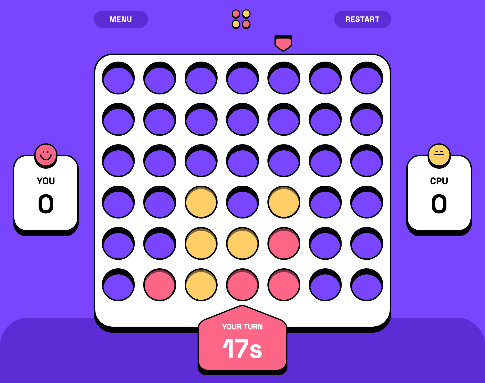

# Connect Four

A classic game of Connect Four with multiple gameplay options, including playing against another human player, playing against the computer. The game features a user-friendly interface, smooth animations, and optimal layout for different screen sizes.

## Table of Contents

- [Game Rules](#game-rules)
- [Demo](#demo)
- [Installation](#installation)
- [Usage](#usage)
- [Technologies Used](#technologies-used)
- [Future Development](#future-development)
- [Contributing](#contributing)

## Game Rules

Connect Four is a two-player game where each player takes turns dropping colored discs into a grid. The goal is to be the first to form a horizontal, vertical, or diagonal line of four discs of your color.

For detailed game rules and strategies, refer to the [Connect Four Wikipedia page](https://en.wikipedia.org/wiki/Connect_Four).

## Demo

Check out the live demo of the game: [Live Demo](https://diaasaur.github.io/connect-four/)

## Installation

To run the game locally, follow these steps:

1. Clone the repository: `git clone https://github.com/xxxxxx/connect-four.git`
2. Navigate to the project directory: `cd connect-four`
3. Install dependencies: `npm install`

## Usage

To start the game, run the following command in the project directory: `npm run dev`
The game will be accessible at `http://localhost:3000` in your web browser.

## Technologies Used

The game is built using the following technologies:

- React
- CSS Modules
- Framer Motion

## Future Development

There are several areas for future development and enhancement of the game, including:

- Adding keyboard input support for moving the counters.
- Implementing online multiplayer functionality to allow players to compete against each other remotely.
- Exploring Monte Carlo Tree Search (MCTS) algorithms to enhance the computer player's AI.

## Contributing

Contributions to the project are welcome! To contribute, please follow these steps:

1. Fork the repository
2. Create a new branch
3. Make your changes
4. Commit and push your changes to your branch
5. Submit a pull request

For bug reports, feature requests, or other discussions, please open an issue on the GitHub repository.
